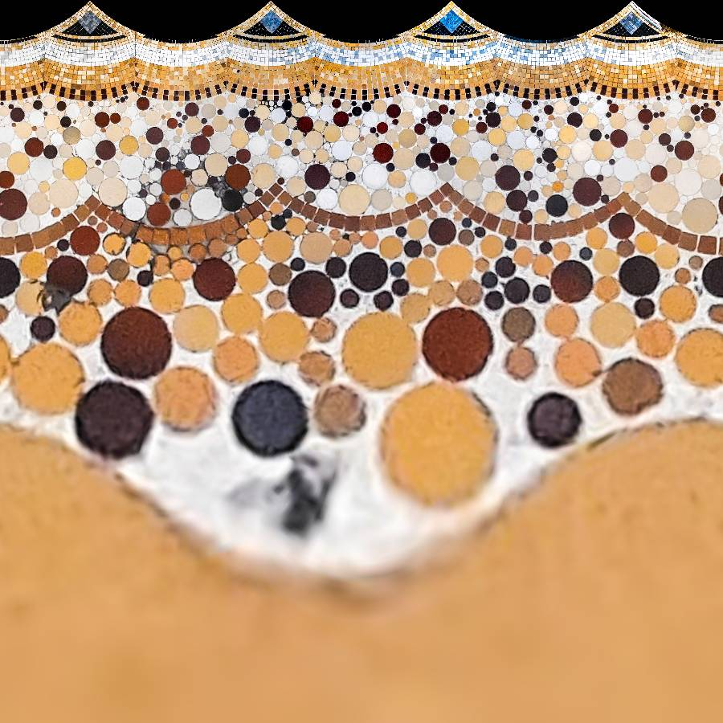

# Depolarizer

Small application to apply a polar-to-Cartesian transformation to round images and kind of _unfold_ them.
Based on previous Java code by [@almudenamcastro](https://github.com/almudenamcastro).
Try the Shiny app at https://enchufa2.shinyapps.io/depolarizer/.

## Example

